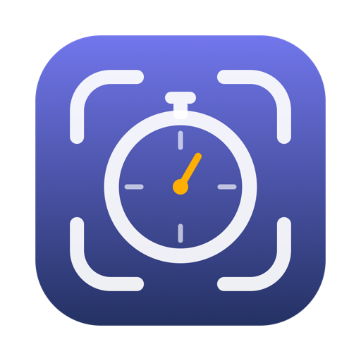
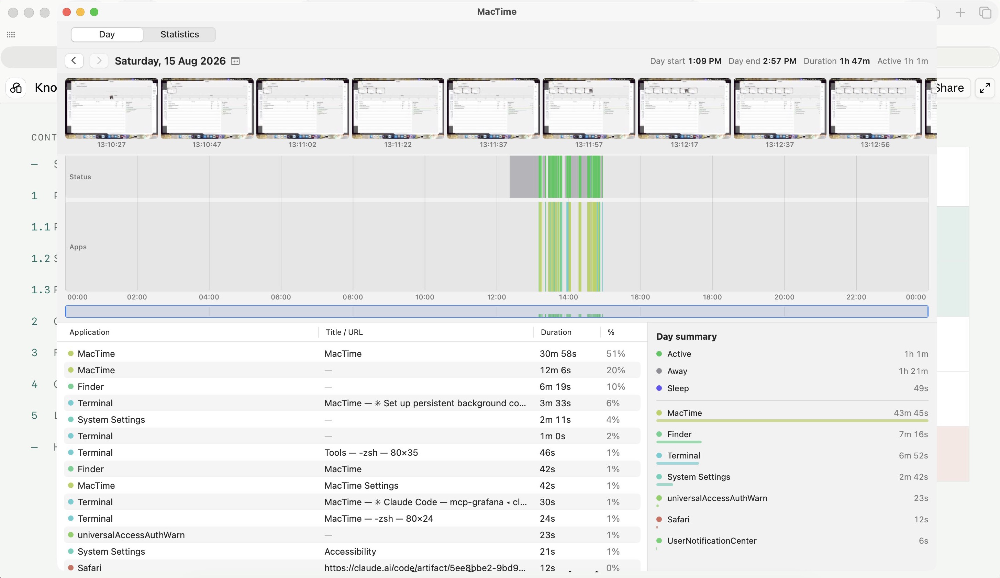

<p align="center">
  
</p>

<h1 align="center">MacTime</h1>

<p align="center">
  Screenshot timeline + app/browser activity tracking for macOS.<br>
  A minimal tracking solution like Manictime designed for Mac.
</p>

<p align="center">
  
</p>

## What it does

- **Screenshots** — captures every display on an interval (default 15s) via
  ScreenCaptureKit, full image + thumbnail per display, into per-day folders.
  Auto-prunes past the retention window (default 14 days). Skips capture while
  the screen is locked or you're idle. Show just the display that held the
  focused window, or every display side by side.
- **Activity tracking** — samples the frontmost app + focused window title every
  3s and collapses them into spans. Idle ("Away") spans are backdated to when
  input actually stopped; sleep is backfilled on wake as its own span kind.
  macOS maintenance dark wakes are recorded as sleep rather than inflating Away.
- **Browser URLs** — records the active tab URL when a browser is frontmost.
  Safari/Chrome via Apple Events, Firefox via the accessibility tree.
- **Day tab** — screenshot strip aligned to the clock, Status/Apps timeline with
  drag-to-select, zoomable via the overview bar, details list and day summary.
  Hovering the timeline previews the nearest capture; the docked viewer follows
  your hover in realtime and zooms/pans.
- **Statistics tab** — From/To range with presets (week, month, YTD, all time…)
  and four charts: Day duration, Top Applications, Top Computer Usage, and an
  attendance calendar heatmap.
- **Menu bar app** — starts quietly in the menu bar with no window and no dock
  icon; the tray icon opens the window, closing it keeps tracking. Optional
  start at login.

## What it doesn't do

MacTime is a pure record of what was on your screen and how long you spent in
each app. It is **not** a productivity suite — there is no tagging, no marking
or labelling of time ranges, no todo list, no Pomodoro timer, no note taking,
no projects/clients, no timesheets or invoicing. Nothing to fill in, nothing to
maintain: it just runs and answers "what was I doing at 3pm, and where did the
day go?".

## Install

Download the latest `MacTime-<version>-macos-arm64.dmg` from
[**Releases**](https://github.com/finaea/mactime/releases/latest), drag MacTime
to Applications, and **right-click → Open** on first launch (the build is
self-signed, not notarized — macOS will complain once).

Requires macOS 15+ on Apple silicon.

On first run, grant the permissions it asks for:

| Permission | Used for | Without it |
|---|---|---|
| Screen Recording | screenshots | no captures |
| Accessibility | window titles (and Firefox URLs) | app names only |
| Automation (per browser) | Safari/Chrome tab URLs | titles only |

## Day tab controls

| Input | Effect |
|---|---|
| Drag on timeline | select a time range (details/summary filter to it) |
| Scroll on timeline | pan the zoomed view (up = back in time) |
| Pinch on timeline | zoom around the cursor |
| Drag on overview bar | select a zoom window; drag inside to pan, edges to resize |
| Scroll / pinch on overview bar | zoom in/out |
| Double-click overview bar | reset to the full day |
| Hover the timeline | preview the nearest capture (position configurable in Settings) |
| `Space` | open the docked screenshot viewer (live) · press again to freeze/unfreeze |
| Click a thumbnail | open the viewer frozen on that capture |
| Scroll / pinch in the viewer | zoom the screenshot (1×–8×) |
| Drag in the viewer | pan while zoomed · double-click to reset to fit |
| `Esc` / ✕ | close the viewer |
| Click the date | calendar popover for jumping to any day |

The viewer is on `Space` rather than an F-key because keyboards whose firmware
owns the F-row as media keys never deliver `F12` to an app at all.

## Data

Everything lives in `~/Library/Application Support/MacTime/`:
SQLite database (`MacTime.db`: activity spans + screenshot index) and
`Screenshots/yyyy-MM-dd/` image folders. Delete the folder, lose the history —
nothing leaves the machine.

## Building from source

Needs only Command Line Tools (no Xcode): Swift 6.1+, macOS 15 SDK.

```bash
swift build                      # compile
tools/bundle-macos.sh            # build + assemble publish/MacTime.app + sign
swift tools/make-icons.swift     # regenerate icns + dmg artwork
tools/make-dmg.sh                # package the dmg
```

Signing: run `tools/make-dev-identity.sh` once (on the machine, not over ssh)
to create a stable self-signed identity — otherwise builds are ad-hoc signed
and macOS drops the TCC permission grants on every rebuild. The bundle script
picks the identity up automatically.

## Layout

```
Sources/MacTime/
├── Trackers/    ActivityService, ScreenshotService, BrowserService, IdleMonitor, AX, PowerState
├── Store/       sqlite3 wrapper + queries (spans, screenshots, day stats)
├── UI/          DayView (timeline/viewer/zoom), StatsView (4 charts), Settings
└── Support/     settings, formatters, app colors, image cache
tools/           bundle, dmg, icon generation, signing identity
```

## License

MIT — see [LICENSE](LICENSE).
