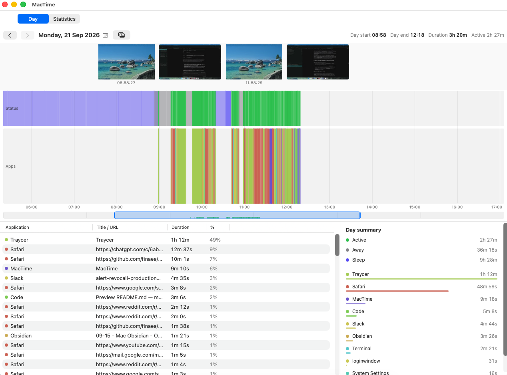
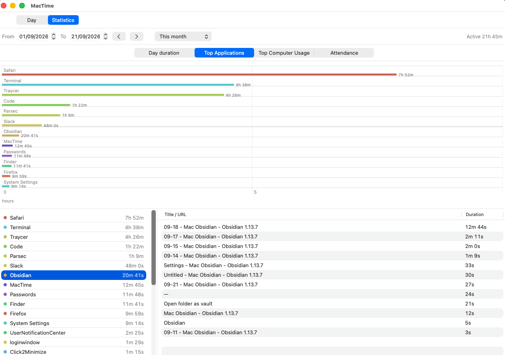

<p align="center">
  
</p>

<h1 align="center">MacTime</h1>

<p align="center">
  Screenshot timeline + app/browser activity tracking for macOS.<br>
  A minimal tracking solution like Manictime designed for Mac.
</p>

<p align="center">
  
</p>

<p align="center">
  
</p>


## What MacTime does

- **Captures screenshots** — MacTime uses ScreenCaptureKit to capture each display at a chosen interval (15 seconds by default). It pauses captures while the screen is locked or the Mac is inactive, and keeps history only for the chosen retention period (14 days by default).
- **Keeps an activity timeline** — The active app and window title are collected to show periods of work, inactivity, and sleep in a clear daily timeline.
- **Shows browser activity** — When a supported browser is active, MacTime can save the current tab’s website. Safari and Chrome use macOS Automation permission; Firefox uses Accessibility permission.
- **Makes the day easy to review** — The Day tab combines screenshots, app activity, time selection, a screenshot viewer, and a daily summary. The timeline can be zoomed and moved to focus on any part of the day.
- **Provides useful statistics** — The Statistics tab includes time-range presets, daily usage, top applications, computer usage, and an attendance-style calendar.
- **Runs quietly when needed** — MacTime can start from the menu bar and continue tracking after its main window is closed. Starting at login is optional.
- **Exports and imports the whole history** — One zip of ordinary JPEGs and JSON, for moving to a new Mac, keeping a backup, or leaving MacTime with your data intact.

MacTime is designed as a record, not a productivity system. It does not include projects, tags, timers, notes, timesheets, or invoicing.

## Install

Download the latest `MacTime-<version>-macos-arm64.dmg` from [**Releases**](https://github.com/finaea/mactime/releases/latest), drag MacTime to Applications, then **right-click → Open** the first time. The build is self-signed and not notarized, so macOS shows a one-time warning.

MacTime requires macOS 15 or later on Apple silicon.

On first launch, macOS asks for only the permissions that enable the selected features:

| Permission | Enables | Without it |
|---|---|---|
| Screen Recording | Screenshot history | No screenshots are captured |
| Accessibility | Window titles and Firefox website activity | App names are still available |
| Automation for each browser | Safari and Chrome website activity | Window titles are still available |

## Day tab controls

| Input | Effect |
|---|---|
| Drag on the timeline | Select a time range; the details and summary follow that selection |
| Scroll on the timeline | Move through the selected view |
| Pinch on the timeline | Zoom around the pointer |
| Drag on the overview bar | Choose or move the visible time range |
| Scroll or pinch on the overview bar | Zoom in or out |
| Double-click the overview bar | Return to the full day |
| Hover over the timeline | Preview the nearest screenshot |
| `Space` | Open the screenshot viewer; press again to hold or resume the live preview |
| Click a thumbnail | Open that screenshot in the viewer |
| Scroll or pinch in the viewer | Zoom the screenshot from 1× to 8× |
| Drag in the viewer | Move around a zoomed screenshot |
| Double-click in the viewer | Return the screenshot to fit view |
| `Esc` or ✕ | Close the viewer |
| Click the date | Open the calendar and choose another day |

## Security & Privacy

MacTime keeps its history on the Mac. It has no account, sync service, analytics, or network upload.

### Protected history

Screenshots, window titles, and browser websites are encrypted before MacTime saves them. The encryption key stays in the Mac’s login keychain, so other apps cannot read those protected details simply by opening MacTime’s history files.

The key remains on the Mac where the history was created. Copying the MacTime data folder to another Mac does not make the history readable there. If the key is unavailable, MacTime stops recording rather than creating a separate unreadable history. Existing history can be opened only by restoring the original login keychain, or by importing an export made beforehand; otherwise, Settings → Delete data → Everything starts a new history.

### Moving to a new Mac

Migration Assistant and a full Time Machine restore both work without any extra step, because both carry the login keychain along with the history.

For anything else — a clean install, a keychain reset, or simply moving the history somewhere a keychain does not reach — use **Settings → Backup**:

| | |
|---|---|
| **Export…** | Writes the whole history to one zip. Asks for Touch ID or your password first. |
| **Import…** | Replaces everything recorded on this Mac with the contents of an export, then restarts MacTime. Also asks first. |

Settings shows how long it has been since the last export. That gap matters more than it looks: MacTime has no recovery code, so an export is the only copy of the history that survives losing this Mac's keychain.

**The export is not encrypted.** That is deliberate — it is what lets the data outlive MacTime, and what makes leaving for another app possible at all — but it means the file holds every screenshot and window title in the open. Keep it somewhere you would keep the originals; put it in an encrypted disk image if it is going to travel.

### Export format

Documented because an export nobody can read without MacTime is not portability. The zip holds:

```
manifest.json       format version, counts, date range, app version
settings.json       excluded apps, retention, website detail
activity.jsonl      one JSON object per line: start, end, app bundle id, app name, title, url, kind
screenshots.jsonl   one JSON object per line: taken_at, day, display_id, is_active, file
screenshots/<day>/  the captures themselves, as ordinary JPEGs
```

Timestamps are ISO 8601. The two record streams are [JSON Lines](https://jsonlines.org) rather than one array, so both MacTime and anything else can read them a record at a time — activity history is never pruned, so those files grow for as long as the install lives. Thumbnails are not included; MacTime regenerates them on import.

### Privacy controls

The following controls are available in Settings:

- **Excluded apps** removes selected apps from screenshots and prevents their window titles and websites from being saved. MacTime can suggest common password managers and messaging apps during first-run setup.
- **Website detail** saves only the website origin by default, such as `https://mail.google.com`. Full addresses can be enabled when that detail is useful.
- **Lock** can require Touch ID or a password before the MacTime window opens.
- **Pause** remains active after a restart, so recording does not begin again unexpectedly.
- **Delete data** removes one day, a date range, or all history from within MacTime.

MacTime’s Screen Recording, Accessibility, and Automation permissions remain limited to MacTime. These permissions are used only for the features described above.

## Building from source

Building MacTime requires a Mac with macOS 15 or later, Apple silicon, and the full Xcode app. The Command Line Tools alone are not enough.

1. Install Xcode from the App Store, then open it once to complete its setup and accept the licence.
2. Clone the repository and enter its folder:

   ```bash
   git clone https://github.com/finaea/mactime.git
   cd mactime
   ```

3. Build the app bundle:

   ```bash
   tools/bundle-macos.sh debug
   ```

4. Open the newly built app:

   ```bash
   open publish/MacTime.app
   ```

5. Grant Screen Recording, Accessibility, and browser Automation permission when macOS asks. The available features follow the same permission table as the downloaded app.

For a release-style build, use `tools/bundle-macos.sh` without `debug`. The resulting app is placed at `publish/MacTime.app`.

Before distributing a local build, `tools/make-dev-identity.sh` can create a stable development signing identity. This helps macOS keep granted permissions across later local builds.

### Optional checks and packaging

```bash
tools/typecheck.sh       # Check the app source, including SwiftUI views
tools/run-tests.sh       # Run date and storage tests
swift tools/make-icons.swift
tools/make-dmg.sh        # Create a DMG in publish/
```

## License

MIT — see [LICENSE](LICENSE).
